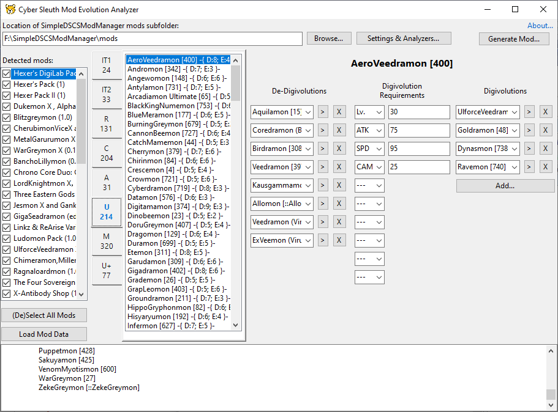

# Cyber Sleuth Mod Evolution Analyzer

A tool to detect and resolve evolution conflicts within Digimon Story Cyber Sleuth modded runs, via providing an UI to edit evolution paths.

## Features

- Generates an override plugin mod to be installed after all others via SimpleDSCSModManager
- Reading information from SimpleDSCSModManager mods, parsing and merging all Digimon evolutions
- Support for both numeric and SimpleDSCSModManager softcode IDs
- A visual editor to track/edit evolution paths, with a detailed list view
- Auto-ordering mods during load based on the orders of previous tool-generated results
- Notification if a Digimon has more than 6 options to (de-)digivolve
- Checks to prevent overwriting a content mod with generated result

## Usage

- Start the tool and select SimpleDSCSModManager's mods subfolder as the working directory
- Reorder (with drag'n'drop) and select (with double-click) the mods you'd like to merge then click on Load Mod Data
- Review the contents of the log window and make changes as necessary
  - **NOTE:** The tool will refuse to generate a mod if a Digimon has more than 6 options to (de-)digivolve, to adhere with Cyber Sleuth's limitations
- After you're done, save the result mod
- Install the newly generated mod as the last one in your SimpleDSCSModManager install order

## Known issues

- There's no support for exposing the "Costumed Agumon" for now
- There's no UI to expose/edit/export evolution requirements
- This tool was developed on Windows 10 and I don't have access to other Windows systems to check requirements

## Modder notes

Generally, most mods attempt to try not to overwrite each other for digivolutions, but due to some limitation, the same can't be applied to de-digivolutions. This tool reads all mod's degeneration.para and evolution_next.para, filters out all mons without a valid ID (incase a mon doesn't exist in the current setup) to free up more slots and merges their results for a starting point. A generated mod by this tool will always completely overwrite the appropriate records within the aforementioned files.

## Development

This tool uses C#/WinForms with default .NET 8.0 libraries. An IDE with recent C# support should be enough.

## License

This tool is licensed under the MIT license.

## Acknowledgments

Thanks to Pherakki for the SimpleDSCSModManager documentation which this tool was partially built on.

Thanks to dantles1992 for the available tutorials to explain some of the game data.

Thanks to the Digimon Cyber Sleuth modding scene for inspiring the creation of this tool.

## Copyright

This tool is not developed, supported, or endorsed by Media.Vision, h.a.n.d or Bandai Namco Entertainment. All other trademarks and copyrights are property of their respective owners.
